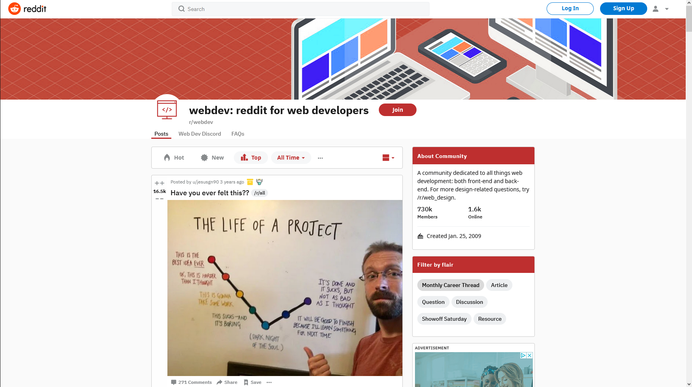
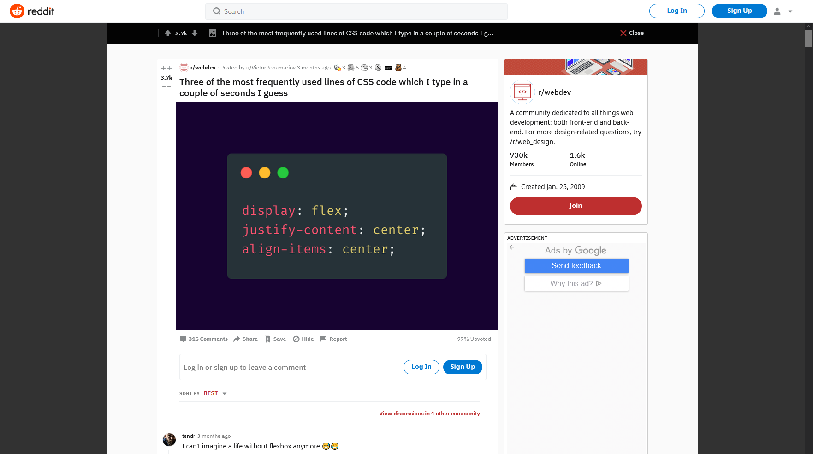

# 
COSC 360 Team 30 Project Proposal

Jarod Algra, Sam Aliyev, Jesse Plamondon, Dakshin Sridhar
  
 

>This project will fully implement a reddit-style discussion forum, from a hand-styled  
>front end using HTML5/CSS and Javascript, to a MySQL database and server-side  
>scripting using PHP? (node pls), and hosted using ???.  
>The website will allow users to login, create a post and view/comment on other posts,  
>along with the functionalities outlined in the Requirements section.

  
  

    

 

## User Functionality:

### Non-registered Users

* Browse discussions
* Search for posts by keywords
* Register for the website by providing name, email, and image(optional?).

### Registered Users:

* Browse discussions
* Search for posts by keywords
* Login with userid and password
* Create a post
* Comment on a post
* Like/Dislike a post
* View/edit profile
* Forgot password - password recovery
* Share/save a post

### Administrator Functionality:

* Search for users by name, email or post
* Enable/disable users
* Edit/remove posts  
  

## General Site Functionality

### Appearance

* Hand-styled layout with contextual menus (i.e. when user is logged in, menus reflect change)
* 2 or 3 column layout using appropriate design principles (i.e. highlighting nav links when hovered over, etc.)
* Navigation breadcrumb strategy (i.e., user can determine where they are in threads)
* Responsive design philosophy
* Collapsable post/threads without page reloading
* Alerts on page changes
* Simple discussion grouping and display
* Styling flourishes
* Accessibility

### Security

* Form validation with JavaScript
* Server-side scripting
* Data storage in MYSQL
* Appropropriate security for data
* Error handling (bad navigation)

### General

* AJAX utilization for asynchronous updates
* Site maintains state
* User images and profile stored in database
* Search and analysis for topics
* Hot threads/hot post tracking
* Visual display of updates, etc (site usage charts, etc.)
* Activity by date
* Tracking (including utilization tracking API or your own with visualization tools)
* Tracking comment history from user’s perspective

